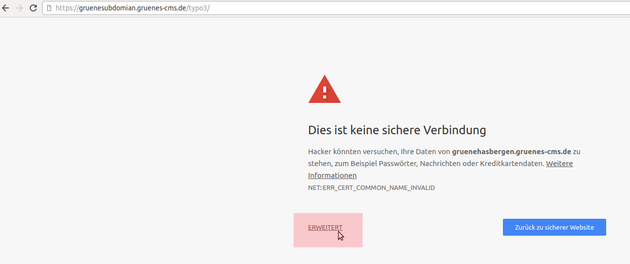
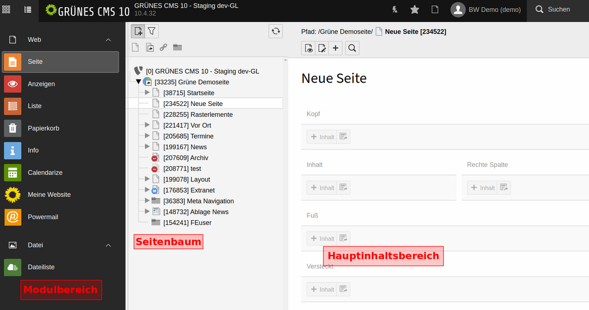
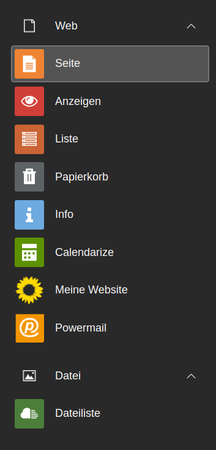
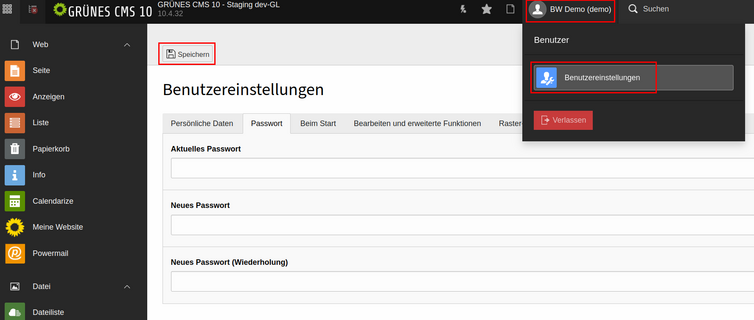

# Einloggen

Ihr habt die Zugangsdaten zur Bearbeitung der Webseite erhalten und wollt nun loslegen. Der Link zum Einloggen lautet:

```plain
https://eure-domain.de/typo3
```

Anschließend seht Ihr das Login-Fenster und könnt eure Zugangsdaten direkt eingeben.

**Wichtig:** In den Browser-Einstellungen müssen **Javascript, Cookies und Popups** aktiviert bzw. erlaubt sein, sonst kann es zu Problemen beim Login oder beim Arbeiten mit dem Content-Management-System kommen.

Falls eure Domain noch nicht bei uns gehostet ist und die Seite unter einer Subdomain eingerichtet wurde, lautet der Login-Link zunächst:

```plain
https://eure-domain.gruenes-cms.de/typo3
```

In diesem Fall wird der Browser zunächst eine Warnmeldung ausgeben. Das Sicherheitszertifikat für die verschlüsselte Verbindung ist auf `gruenes-cms.de` ausgestellt und schon die Verwendung einer Subdomain wie `gruenerverband.gruenes-cms.de` stellt eine Abweichung dar. Die Warnmeldung des Browsers kann ignoriert werden, indem auf `Erweitert` geklickt und anschließend die angeblich unsichere Seite geladen wird.



Nach dem erfolgreichen Login werdet Ihr ins Backend, also den Bearbeitungsbereich, eurer Webseite weitergeleitet und befindet euch nun in der Seitenansicht.



## 1. Modulbereich



Ganz links befinden sich die Module, hinter denen sich verschiedene Funktionen und Ansichten verbergen. Am wichtigsten sind die [Web-Module „Seite“ und „Liste“](https://gcms-intern.de/erste-schritte/erste-schritte-volltext/article/seitenansicht_vs_listenansicht/) für die Bearbeitung der Webseite und [die „Dateiliste“](https://gcms-intern.de/erste-schritte/erste-schritte-volltext/article/die-dateiliste-1/) als Ablage für Bilder und Dokumente.

Die **Seitenansicht** ist das wichtigste Modul in TYPO3. Inhalte, die direkt auf einer Seite der Homepage sichtbar sind und nicht erst über ein Plugin eingebunden werden müssen, sind über das Web-Modul „Seite“ zu sehen: also typische Seiteninhalte wie „Text“, „Text und Bild“, „Bild“ sowie spezielle Seiteninhalte und alle Plugins. Die Seitenansicht ist so etwas wie die technische Rückansicht eurer Webseite; Ihr seht die Inhalte in den jeweiligen Seitenbereichen.<

Die **Listenansicht** ist besonders für das Anlegen und Verwalten von News und Terminen wichtig.

Die **Dateiliste** dient als Ablage für Bilder, PDFs und andere Dateien. Die Datei muss zunächst hier hochgeladen sein, bevor sie als "Text und Bild"-Element online gestellt werden kann.

Globale Einstellungen für die Webseite befinden sich unter dem Modul "**Meine Webseite**": hier geht es um Kopfgrafik, Menü, Mehr-Links oder die Social Buttons. Mehr zu den Einstellungsoptionen könnt Ihr hier nachlesen: [Modul "Meine Webseite"](https://gcms-intern.de/anleitungen/single/modul-meine-webseite)

## 2. Seitenbaum

In der Mitte befindet sich der „Seitenbaum“, bzw. die „Navigationsleiste“. Hier wird die Seite ausgewählt, die bearbeitet werden soll.

## 3. Hauptinhaltsbereich

Hier erscheinen die Datensätze der ausgewählten Seite. Die Ansicht kann sich abhängig vom gewählten Modul (Seite, Liste, etc.) unterscheiden. Im Detailbereich findet der Großteil der redaktionellen Arbeit statt. Hier werden Inhalte erstellt, bearbeitet, positioniert und gelöscht.

## 4. Kopf-Leiste (Abmelden)

Hier befinden sich einige interne Links (z.B. zur Piwik-Statistik), der Abmelde-Button, die Benutzereinstellungen sowie einige andere Tools, wie die geöffneten und kürzlich verwendeten Dokumente.

Wie ein erster Datensatz erstellt wird, könnt Ihr im Artikel [Text mit Bild erstellen](https://gcms-intern.de/anleitungen/single/text-mit-bild) nachlesen.

Weitere Kurzanleitungen findet Ihr unter <http://gcms-intern.de/erste-schritte/>

Das **TYPO3-Passwort** kann über die Benutzereinstellungen geändert werden. Klicke in der Kopfleiste auf das User-Icon, um dein Benutzerprofil zu ändern.


